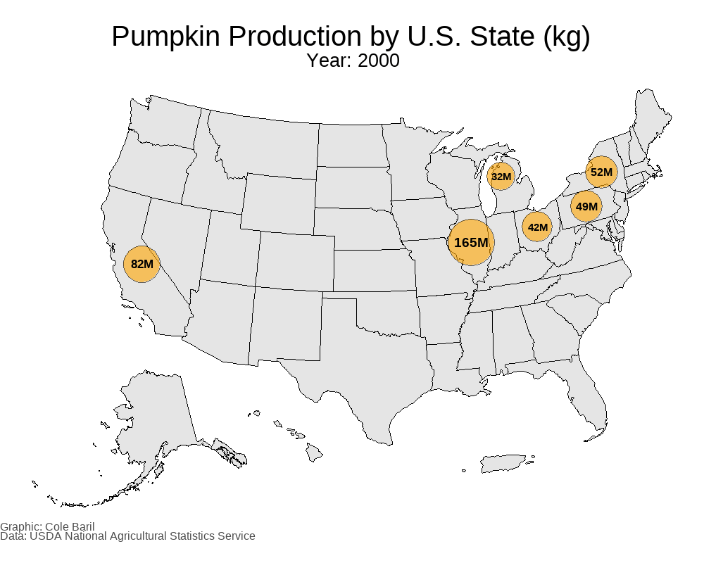

```{r setup, include = TRUE, echo = FALSE, message = FALSE}
knitr::opts_chunk$set(fig.width = 12, fig.asp = .7, out.width = "90%", echo = FALSE, warning = FALSE, message = FALSE)

require(pacman)
p_load(spellbook, tidyverse, janitor, here, showtext, tidytext, wordcloud2, tm, grDevices,
       usmap, ggrepel, tidygeocoder, sf, rnaturalearth, rnaturalearthdata, png, grid, igraph, ggraph,
       ggridges, ggside, ggnewscale, gganimate, gifski)

options(scipen = 999)

# Load grobs for use in plots

bat_grob <- rasterGrob(readPNG(here("spooktober/Images/bat.png")), interpolate = TRUE)
bats_moon_grob <- rasterGrob(readPNG(here("spooktober/Images/bats_moon.png")), interpolate = TRUE)
ghost_grob <- rasterGrob(readPNG(here("spooktober/Images/ghost.png")), interpolate = TRUE)
pumpkin_grob <- rasterGrob(readPNG(here("spooktober/Images/pumpkin.png")), interpolate = TRUE)
decorations_grob <- rasterGrob(readPNG(here("spooktober/Images/garland.png")), interpolate = TRUE)
pumpkin_candy_grob <- rasterGrob(readPNG(here("spooktober/Images/pumpkin basket.png")), interpolate = TRUE)
witch_grob <- rasterGrob(readPNG(here("spooktober/Images/witch.png")), interpolate = TRUE)
hhouse_grob <- rasterGrob(readPNG(here("spooktober/Images/haunted-house.png")), interpolate = TRUE)
hhouse_ghost_grob <- rasterGrob(readPNG(here("spooktober/Images/haunted-house_ghost.png")), interpolate = TRUE)
pumpkin_1_grob <- rasterGrob(readPNG(here("spooktober/Images/pumpkin_1.png")), interpolate = TRUE)
pumpkin_2_grob <- rasterGrob(readPNG(here("spooktober/Images/pumpkin_2.png")), interpolate = TRUE)
```

<style>
mark {
  background-color: #251a47; /* Purple background */
  color: #e9731d; /* White text color for contrast */
  padding: 0.2em; /* Optional: add some padding for better visual appearance */
  border-radius: 3px; /* Optional: add rounded corners */
}
</style>


<style>
   blockquote {
   background-color: #e9731d;
   color: black;
   font-weight: bold;
  }
 </style>


### <mark> __🎃 Spooktober 2025 🎃__ </mark>


Welcome to __Spooktober: Data After Dark__, a month-long data visualization project where each day of October conjures a brand-new, spooky-themed plot. Using R and ggplot2, I’ll be exploring playful, eerie, and sometimes chilling datasets reimagined through color, theme, and story. Posts will start on October 1, 2025!

The goal of this project is two fold:

1. To celebrate the art of data visualization through a seasonal, Halloween-inspired lens.
2. To challenge myself to create 31 distinct visualizations in 31 days.

Expect plenty of black cats, haunted forests, pumpkins, cobwebs, ghosts, and bats woven not in words, but in data.

<br>

Find all the code to generate the plots on my GitHub page [here](https://github.com/colebaril/dataviz/tree/main/spooktober)

<br>
<br>
<br>


### <mark> __🎃 October 1: Horror Movie Release Dates 🎃__ </mark>

<br>

```{r, oct1, fig.showtext = TRUE, fig.width = 9, eval = TRUE, echo = TRUE}
horror_movies <- read_csv(here("spooktober/Data/horror_movies.csv")) |> select(-1) |> 
  drop_na(release_date) |> 
  mutate(release_date = as.Date(release_date),
         year = year(release_date),
         month = month(release_date, label = TRUE, abbr = TRUE),
         day = day(release_date)
  )

release_counts <- horror_movies |> 
  count(year, month) 

pumpkin_gradient <- c("#FFD8B1", "#FFA500", "#FF8C00", "#FF4500", "#CC3700")

ggplot(release_counts |> filter(year >= 1980), aes(x = month, y = year, fill = n)) +
  geom_tile(color = "white") +
  scale_fill_gradientn("Number of Horror Movies", colours = pumpkin_gradient) +
  scale_y_continuous(breaks = seq(min(release_counts$year, na.rm = TRUE),
                                  max(release_counts$year, na.rm = TRUE),
                                  by = 10),
                     expand = c(.01, .01)) +
  labs(title = "Most Horror Movies are Released in October", 
       x = "Month", 
       y = "Year") +
  theme_bw(base_size = 12) +
  theme_parchment(remove_grid = TRUE) +
  theme(axis.text = element_text(size = 13),
        axis.title = element_text(size = 14),
        plot.title = element_text(size = 20)) +
  inscribe(include_data_source = TRUE, data_source = "The Movie Database")
```
<br>
```{r, oct1_popularity, fig.showtext = TRUE, fig.width = 9, eval = TRUE, echo = TRUE}
horror_movies |> 
  summarise(month_mean = mean(popularity),
            .by = month) |> 
  ggplot(aes(x = month, y = month_mean)) +
  geom_col(alpha = 0.8, fill = "#FF8C00", colour = "black") +
   annotation_custom(
    bat_grob,
    xmin = 4, xmax = 5,
    ymin = 6, ymax = 7) +
   annotation_custom(
    ghost_grob,
    xmin = 1, xmax = 2,
    ymin = 5, ymax = 6) +   
  annotation_custom(
    witch_grob,
    xmin = 10, xmax = 11,
    ymin = 5, ymax = 6) +  
  theme_parchment(remove_grid = TRUE) +
    theme(axis.text = element_text(size = 13),
        axis.title = element_text(size = 14)) +
  labs(x = "Month", y = "Mean Movie Popularity",
       title = "Horror Movies in January are Not Popular") +
  inscribe(include_data_source = TRUE, data_source = "The Movie Database")

```


> As expected, there are more horror movie releases in October, particularly beginning in the 2000s. From 2010 to present, this trend continues. What I did not expect to find was a considerable number of horror movie releases in January. I learned that this is likely due to [Dump Months](https://en.wikipedia.org/wiki/Dump_months) in which movies that performed poorly at test screenings, movies with lesser known actors, or less popular genres (e.g., horror) are released. The rationale for this is primarily because audiences are lower and inconsistent in January and February compared to holiday months.

> Interestingly, the January Dump Month trend, in addition to the rationale behind them, is confirmed by looking at the mean movie popularity each month. January releases have the worst popularity, while the most popular horror movies are released in the summer months. October has a comparably smaller mean popularity compared to summer, but this is likely due to the fact that so many more horror movies are released in October than in any other month. 


### <mark> __🎃 October 2: Horror Movie Title Word Cloud 🎃__ </mark>

<br> 

```{r, horror_movie_word_cloud, eval = TRUE, echo = TRUE}
autumn <- colorRampPalette(c("#FF0000", "#ffcc00"))(150)

set.seed(123)
autumn_random <- sample(autumn, size = 150)

movie_words <- horror_movies |>  
  select(title) |> 
  mutate(title = str_to_lower(title),
         title = str_replace_all(title, "[^a-z\\s]", "")) |> 
  unnest_tokens(word, title) |> 
  filter(!word %in% stopwords("en")) |> 
  filter(str_length(word) > 2) |> 
  filter(!word %in% c("ii", "iii", "iv"))

word_counts <- movie_words |> 
  count(word, sort = TRUE)

wordcloud2(head(word_counts, 150), size = 0.8, color = autumn_random, backgroundColor = "black")
```

### <mark> __🎃 October 3: Haunted Places 🎃__ </mark>

```{r, us_haunted_states, fig.showtext = TRUE, eval = TRUE, echo = TRUE}
states <- usmap::statepop |> select(full) |> pull()
statepop <- usmap::statepop

haunted_states <- read_csv(here("spooktober/Data/haunted_places.csv")) |> 
  filter(state %in% states) |> 
  reframe(n = n(),
          .by = state) |> 
  left_join(statepop, by = c("state" = "full")) |> 
  mutate(hpc = n / pop_2022)

purple <- colorRampPalette(c("#ecb3ff", "#4b0066"))(50)


plot_usmap(data = haunted_states, regions = "states", values = "n") +
  scale_fill_gradientn("Number of Haunted Places", colors = purple) +
  theme(plot.title = element_text(face = "bold", size = 25, hjust = 0.5),
      plot.subtitle = element_text(size = 15, hjust = 0.5),
      plot.caption = element_text(size = 12),
      legend.position = "top",
      legend.key.width = unit(3, "lines"),
      legend.title = element_text(face = "bold", size = 15, hjust = 0.5),
      legend.title.position = "top",
      legend.text = element_text(size = 12)) +
  annotation_custom(
    bat_grob,
    xmin = 1000000, xmax = 1550000,
    ymin = -3500000, ymax = -500000) +
  annotation_custom(
    ghost_grob,
    xmin = -2500000, xmax = -1900000,  
    ymin =  300000,  ymax = 900000) +     
  inscribe(include_data_source = TRUE, data_source = "The Shadowlands Haunted Places Index")
```

> Interestingly, California and Texas have the highest number of haunted places. I wondered if the number
of haunted places in a state was related to its population, and sure enough it was. 

```{r, us_haunted_states_2, fig.showtext = TRUE, eval = TRUE, echo = TRUE}
# Are the number of proported haunted places comparable to population or area?
top_states <- haunted_states |> 
  slice_max(n, n = 10)

haunted_states |> 
  ggplot(aes(x = pop_2022, y = n)) +
  geom_label_repel(
    data = top_states,
    aes(label = abbr),
    size = 5,
    fill = "forestgreen",      
    color = "black",
    fontface = "bold",
    box.padding = 0.5,    
    point.padding = 0.3,  
    segment.color = "gray40", 
    segment.size = 0.5,
    force = 1,
    alpha = .6) +
  geom_point(alpha = 0.6, size = 4, colour = "#F87217") +
   annotation_custom(
    bats_moon_grob,
    xmin = 4000000, xmax = 8000000,
    ymin = 900, ymax = 1100) +
  scale_x_continuous(trans = "log1p",
                     labels = scales::label_number(scale = 1e-6, suffix = "M")) +
  theme_parchment(remove_grid = TRUE) +
   theme(axis.title = element_text(size = 14),
        axis.text = element_text(size = 12),
        axis.line = element_line(colour = "black"),
        panel.grid.major = element_blank(),
        panel.grid.minor = element_blank(),
        panel.border = element_blank(),
        plot.title = element_text(margin = margin(t = 0, b = -30), hjust = 0.1, vjust = -5, size = 40),
        plot.margin = margin(t = 0, r = 10, b = 10, l = 10)) +
  
  labs(title = "Hauntings Rise \nwith the Masses",
       x = "State Population",
       y = "Number of Haunted Places") +
  inscribe(include_data_source = TRUE, data_source = "The Shadowlands Haunted Places Index") 

# Per capita
top_states_hpc <- haunted_states |> 
  slice_max(hpc, n = 10)

haunted_states |> 
  ggplot(aes(x = pop_2022, y = hpc, size = n)) +
  geom_label_repel(
    data = top_states_hpc,
    aes(label = abbr),
    size = 5,
    fill = "forestgreen",      
    color = "black",
    fontface = "bold",
    box.padding = 0.5,    
    point.padding = 0.3,  
    segment.color = "gray40", 
    segment.size = 0.5,
    force = 2,
    alpha = .6) +
  geom_point(alpha = 0.6, colour = "#F87217") +
     annotation_custom(
    hhouse_ghost_grob,
    xmin = 20000000, xmax = 40000000,
    ymin = 0.000055, ymax = 0.0001) +
  scale_x_continuous(trans = "log1p",
                     labels = scales::label_number(scale = 1e-6, suffix = "M")) +
  scale_y_continuous(labels = scales::label_percent()) +
    scale_size_continuous(
    name = "Number of Haunted Places",
    range = c(4, 12)) +
  theme_parchment(remove_grid = TRUE) +
  theme(axis.title = element_text(size = 14),
        axis.text = element_text(size = 12),
        axis.line = element_line(colour = "black"),
        panel.grid.major = element_blank(),
        panel.grid.minor = element_blank(),
        panel.border = element_blank(),
        plot.title = element_text(margin = margin(t = 40, b = -30), hjust = 0.5, vjust = -5, size = 40),
        legend.position = "inside",
        legend.position.inside = c(0.5, 0.75)) +
  labs(title = "Density of the Damned: \nFewer People, More Ghosts",
       x = "State Population",
       y = "Haunted Places per Capita (%)") +
  inscribe(include_data_source = TRUE, data_source = "The Shadowlands Haunted Places Index") +
  guides(size = guide_legend(nrow = 1))


```

> However, interestingly, when I grahped the number of haunted places *per capita*, the graph completely reversed: 
there are more haunted places per capita in the least populous states. 


### <mark> __🎃 October 4: US Pumpkin Production 🎃__ </mark>

```{r, pumpkin_prod_gif, eval = FALSE, echo = TRUE}
pumpkin_prod <- read_csv(here("spooktober/Data/us_pumpkins.csv")) |> 
  clean_names() |> 
  select(year, state, value) |> 
  filter(!value == "(D)") |> 
  mutate(value = as.numeric(gsub(",", "", value))) |> 
  mutate(value_kg = value*45.36) |> 
  mutate(state = str_to_title(state))

us_states <- us_map("states")

state_centers <- st_centroid(us_states)

state_centers_coords <- state_centers |>
  st_coordinates() |> 
  as.data.frame() |> 
  bind_cols(us_states |> st_drop_geometry())

bubble_data <- state_centers_coords |> 
  left_join(pumpkin_prod, by = c("full" = "state")) |> 
  drop_na(value) |> 
  mutate(label = paste0(round(value_kg / 1e6), "M"))

p <- ggplot() +
  geom_sf(data = us_states, fill = "grey90", color = "black") +
  geom_point(
    data = bubble_data,
    aes(x = X, y = Y, size = value_kg),
    shape = 21,              
    fill = "orange",          
    color = "black",   
    stroke = 1,               
    alpha = 0.6
  ) +
  scale_size_continuous("Pumpkin Production (kg)", range = c(10, 40), guide = "none") +
   ggnewscale::new_scale("size") +
   geom_text(
    data = bubble_data,
    aes(x = X, y = Y, label = label, size = value_kg),
    color = "black",
    fontface = "bold"
  ) +
  scale_size_continuous(range = c(3, 6), guide = "none") +  # text size
  theme_void() +
  theme(plot.title = element_text(hjust = 0.5, size = 30, face = "bold"),
        plot.subtitle = element_text(hjust = 0.5, size = 20, face = "bold"),
        plot.caption = element_text(hjust = 0, face = "bold", size = 12, colour = "#4d4d4d", )) +
  labs(title = "Pumpkin Production by U.S. State (kg)",
       subtitle = "Year: {closest_state}",
       caption = "Graphic: Cole Baril\nData: USDA National Agricultural Statistics Service") +
  transition_states(year, transition_length = 2, state_length = 1) +
  ease_aes('linear')

animate(p, nframes = n_distinct(bubble_data$year), fps = 1, width = 1000, height = 800, renderer = gifski_renderer(loop = TRUE))

anim_save(here("spooktober/Graphics/October 4 - US Pumpkin Production.gif"))
```



```{r, pumpkin_prod, fig.showtext = TRUE, eval = TRUE, echo = TRUE}
pumpkin_prod <- read_csv(here("spooktober/Data/us_pumpkins.csv")) |> 
  clean_names() |> 
  select(year, state, value) |> 
  filter(!value == "(D)") |> 
  mutate(value = as.numeric(gsub(",", "", value))) |> 
  mutate(value_kg = value*45.36) |> 
  mutate(state = str_to_title(state)) |> 
  filter(!state %in% c("Other States"))

top_states <- pumpkin_prod |> 
  group_by(state) |>
  summarise(total_kg = sum(value_kg, na.rm = TRUE)) |>
  arrange(desc(total_kg)) |>
  slice_head(n = 5) |>
  pull(state)

pumpkin_plot_data <- pumpkin_prod |>
  mutate(highlight = ifelse(state %in% top_states, state, "Other"))

halloween_colors <- c("#E66101", "#1B9E77", "#7570B3", "#264653", "#F1C40F")

color_values <- c(
  setNames(rep("grey70", length(unique(pumpkin_plot_data$highlight)) - 5), 
           setdiff(unique(pumpkin_plot_data$highlight), top_states)),
  setNames(halloween_colors, top_states)
)

ggplot(pumpkin_plot_data, aes(x = year, y = value_kg, group = state)) +
  geom_line(aes(color = highlight), linewidth = 1.5, alpha = 0.8) +
  scale_color_manual(
    values = color_values,
    guide = guide_legend(override.aes = list(alpha = 1, size = 1.5))) +
     annotation_custom(
    pumpkin_1_grob,
    xmin = 2004, xmax = 2009,
    ymin = 275000000, ymax = 325000000) +
       annotation_custom(
    pumpkin_2_grob,
    xmin = 2007, xmax = 2011,
    ymin = 290000000, ymax = 340000000) +
  scale_y_continuous(labels = scales::label_number(scale = 1e-6, suffix = "M", accuracy = 1)) +
  scale_x_continuous(expand = c(0, 0)) +
  theme_parchment(remove_grid = TRUE) +
  theme(legend.position = "inside",
        legend.position.inside = c(0.1, 0.85),
        legend.title = element_text(size = 16),
        axis.title = element_text(size = 15),
        axis.text = element_text(size = 14),
        axis.line = element_line(colour = "black"),
        panel.grid.major = element_blank(),
        panel.grid.minor = element_blank(),
        panel.border = element_blank()) +
  labs(
    title = "Pumpkin Power: Illinois Leads the Nation",
    x = "Year",
    y = "Pumpkin Production (kg)",
    color = "Top 5 States") +
  inscribe(include_data_source = TRUE, data_source = "USDA National Agricultural Statistics Service")
```

> Illinois is the nation’s leading pumpkin producer, thanks to a combination of ideal growing conditions, robust processing infrastructure, and strategic location. The state’s warm summers and well-draining soils support high yields and quality pumpkins, while processing plants such as [Nestlé Libby in Morton](https://extension.illinois.edu/pumpkins) and [Seneca Foods in Princeville](https://ipmnewsroom.org/illinois-is-the-nations-pumpkin-producer-heres-why/?) handle much of the nation’s canned pumpkin supply.


### <mark> __🎃 October 5: Halloween Candy Preferences 🎃__ </mark>

```{r, candy2, eval = TRUE, echo = TRUE, fig.showtext = TRUE}
candy <- read_csv(here("spooktober/Data/candy-data.csv")) |> 
  rename("peanuty-almondy" = "peanutyalmondy",
         "crisped rice wafer" = "crispedricewafer",
         "Price Percent" = "pricepercent",
         "Win Percent" = "winpercent",
         "Sugar Percent" = "sugarpercent",
         "Name" = "competitorname") |> 
  rename_with(str_to_title)
         


flavor_cols <- c("Chocolate", "Fruity", "Caramel", "Peanuty-Almondy",
                 "Nougat", "Crisped Rice Wafer", "Hard", "Bar", "Pluribus")

flavor_data <- candy %>% select(all_of(flavor_cols))

co_matrix <- t(flavor_data) %*% as.matrix(flavor_data)

diag(co_matrix) <- 0

g <- graph_from_adjacency_matrix(co_matrix, mode = "undirected", weighted = TRUE)

edge_weights <- apply(as_edgelist(g), 1, function(edge) {
  attr1 <- edge[1]; attr2 <- edge[2]
  mean(candy$`Win Percent`[candy[[attr1]] == 1 & candy[[attr2]] == 1], na.rm = TRUE)
})

E(g)$avg_win <- edge_weights

ggraph(g, layout = "fr") +
  geom_edge_link(aes(width = weight, color = avg_win), alpha = 0.7) +
  geom_node_point(size = 8, color = "orange") +
  geom_node_text(aes(label = name),  size = 4, fontface = "bold", nudge_y = -0.05) +
  scale_edge_width(range = c(0.5, 5)) +
  scale_edge_color_gradient(low = "lightblue", high = "darkred") +
  theme_void() +
  theme(plot.title = element_text(size = 20, face = "bold", hjust = 0),
        legend.position = "left",
        legend.justification = "left",
        legend.box.just = "left",
        legend.title.align = 0,                    
        legend.text.align = 0,                     
        legend.key.width = unit(1.5, "lines"),
        legend.text = element_text(size = 13),
        legend.title = element_text(
        face = "bold",
        size = 15,
        hjust = 0,                               
        vjust = 0.5,
        margin = margin(b = 5)),
        plot.margin = unit(c(1, 1, 1, 1), "cm")) +
  labs(title = "Sweet Spots: Popular Candy Attributes and Their Co-occurrences",
       edge_color = "Win Percent", edge_width = "Co-occurrence") +
  inscribe(type = "plot", include_data_source = TRUE, data_source = "Walt Hickey Halloween Candy Power Ranking ")
```


### <mark> __🎃 October 6: Spirit Halloween 🎃__ </mark>

```{r, fig.showtext = TRUE, eval = TRUE, echo = TRUE}

# Load Spirit Halloween store data
spirit_halloween <- read_csv(here("spooktober/Data/spirit_halloween_stores_geocoded.csv")) |>
  select(-1)

spirit_sf <- st_as_sf(spirit_halloween,
                      coords = c("long", "lat"),
                      crs = 4326)

# Load world map
world <- ne_countries(scale = "large", returnclass = "sf")

# Filter to US & Canada
na_map <- world %>%
  filter(admin %in% c("United States of America", "Canada"))

usa <- na_map %>% filter(admin == "United States of America")
canada <- na_map %>% filter(admin == "Canada")

# Crop USA to remove Alaska and Hawaii (keep only mainland)
usa_mainland <- st_crop(usa, xmin = -125, xmax = -66, ymin = 24, ymax = 50)

# Combine mainland USA + Canada
na_mainland <- rbind(usa_mainland, canada)

# Transform store data to match mainland CRS
spirit_mainland <- st_transform(spirit_sf, st_crs(2163))

# US states
us_states <- ne_states(country = "United States of America", returnclass = "sf") |> filter(name != "Alaska")

# Canadian provinces
ca_provinces <- ne_states(country = "Canada", returnclass = "sf")

# ---- Mainland map ----
mainland <- ggplot() +
  geom_sf(data = na_mainland, fill = "gray95", color = "gray70") +
  geom_sf(data = us_states, fill = NA, color = "black", size = 0.3) +  # US states
  geom_sf(data = ca_provinces, fill = NA, color = "black", size = 0.3) + # Canada provinces
  geom_sf(data = spirit_mainland |> filter(region != "AK"), aes(size = n),
          shape = 21, fill = "purple", color = "black",
          alpha = 0.6) +
  coord_sf(crs = st_crs(2163),
           xlim = c(-2500000, 3200000),
           ylim = c(-2300000, 4000000)) +
  scale_size_continuous(range = c(2, 10), name = "Number of Spirit \nHalloween Stores")

# ---- Alaska inset ----
alaska_map <- ggplot() +
  geom_sf(data = usa, fill = "gray95", color = "gray70") +
  geom_sf(data = st_transform(spirit_sf, st_crs(3467)),
          aes(size = n), shape = 21, fill = "purple", color = "black",
          alpha = 0.6, show.legend = FALSE) +
  coord_sf(crs = st_crs(3467),
           xlim = c(-2400000, 1600000),
           ylim = c(200000, 2500000),
           expand = FALSE, datum = NA) +
  scale_size_continuous(range = c(2, 10)) +
    theme(
    panel.background = element_rect(fill = NA),
    plot.background = element_rect(fill = NA),
    panel.border = element_blank()
  )

# ---- Hawaii inset ----
hawaii_map <- ggplot() +
  geom_sf(data = usa, fill = "gray95", color = "gray70") +
  geom_sf(data = st_transform(spirit_sf, st_crs(4135)),
          aes(size = n), alpha = 0.6, shape = 21, fill = "purple", color = "black",
          show.legend = FALSE) +
  coord_sf(crs = st_crs(4135),
           xlim = c(-161, -154),
           ylim = c(18, 23),
           expand = FALSE, datum = NA) +
  scale_size_continuous(range = c(2, 10)) +
    theme(
    panel.background = element_rect(fill = NA),
    plot.background = element_rect(fill = NA),
    panel.border = element_blank()
  )

# ---- Combine with insets ----
final_map <- mainland +
  annotation_custom(
    grob = ggplotGrob(alaska_map),
    xmin = -2750000,
    xmax = -2750000 + (1600000 - (-2400000)) / 2.5,
    ymin = -2450000,
    ymax = -2450000 + (2500000 - 200000) / 2.5
  ) +
  annotation_custom(
    grob = ggplotGrob(hawaii_map),
    xmin = -1250000,
    xmax = -1250000 + (-154 - (-161)) * 120000,
    ymin = -2450000,
    ymax = -2450000 + (23 - 18) * 120000
  )

# Read the PNG image
logo <- readPNG(here("spooktober/spirit_logo.png"))

# Convert to a raster grob
logo_grob <- rasterGrob(logo, interpolate = TRUE)

final_map +
  theme_void() +
   theme(
        plot.title = element_text(hjust = 0.5, size = 35, face = "bold"),
        legend.position = "inside",
        legend.position.inside = c(0.85, 0.75),
        legend.key.width = unit(4, "lines"),
        legend.title = element_text(face = "bold", size = 15, hjust = 0.5),
        legend.text = element_text(size = 12) 
        ) +
    annotation_custom(
        logo_grob,
        xmin = 1.4e6,   # far left
        xmax = 2.6e6,   # far right
        ymin = 3.2e6,   # lower
        ymax = 4.1e6    # upper
      ) +
  inscribe(type = "plot", include_data_source = TRUE, data_source = "Spirit Halloween")


```

<!--
### <mark> __🎃 October 7: Retail Spending 🎃__ </mark>
-->
```{r, retail_spending, fig.showtext = TRUE, eval = FALSE}
retail_spending <- read_csv(here("spooktober/Data/halloween_spending_totals_NRF.csv")) |> 
  pivot_longer(!year, names_to = "category", values_to = "amount") |> 
  mutate(amount = as.numeric(amount)) |> 
  mutate(category = str_to_title(category))

ggplot(retail_spending |> filter(category != "Total"), aes(x = year, y = amount, fill = category)) +
  geom_area(position = "stack", alpha = 0.9, color = "black", size = 0.2) +
  scale_fill_manual("Spending Category", values = c("#E66101",
                                                     "#1B9E77",
                                                     "#7570B3",
                                                     "#264653"),
                    guide = guide_legend(nrow = 1)) +
  scale_y_continuous(expand = c(0, 0)) +
  scale_x_continuous(expand = c(0, 0), breaks = seq(2006, 2025, by = 3)) +
  theme_parchment(remove_grid = TRUE) +
  theme(axis.title = element_text(size = 15),
        axis.text = element_text(size = 14),
        axis.line = element_line(colour = "black"),
        panel.grid.major = element_blank(),
        panel.grid.minor = element_blank(),
        panel.border = element_blank(),
        legend.position = "inside",
        legend.position.inside = c(0.5, 0.83),
        legend.background = element_rect(fill = "transparent"),
        plot.title = element_text(vjust = -5.5, margin = margin(t = 0, b = 0)),
        plot.margin = margin(t = 0, r = 10, b = 10, l = 10)
        ) +
   annotation_custom(
    pumpkin_candy_grob,
    xmin = 2006, xmax = 2008,
    ymin = 6, ymax = 8) +
   annotation_custom(
    decorations_grob,
    xmin = 2009, xmax = 2011,
    ymin = 7.5, ymax = 9.5) +   
  annotation_custom(
    witch_grob,
    xmin = 2006, xmax = 2008,
    ymin = 9, ymax = 11) +  
  
  labs(
    title = "U.S. Halloween Spending by Category, 2005–2025",
    x = "Year", y = "Spending (Billions, USD)"
  ) +
  inscribe(type = "plot", include_data_source = TRUE, data_source = "National Retail Federation")
```

<!--
> Halloween spending in the U.S. has been steadily increasing year over year. Interestingly, there is a noticeable dip in spending for candy, cards and costuimes around 2020, while decoration spending doesn't decrease to the same extent. This could indicate that people went out less (e.g., trick-or-treating, parties), but still decorated their homes."
-->


<!--
### <mark> __🎃 October 8: UFO Sightings 🎃__ </mark>
-->
```{r, ufo_sightings, fig.showtext = TRUE, eval = FALSE}
ufo <- read_csv(here("spooktober/Data/UFO_sightings.csv"))


# This dataset is very messy. Notably, the countries/cities are not standardized. 
# I believe this dataset was all user-submitted with no drop-down selectors. 
# I will do my best to clean the data, but the quality of the data may not be there. 

ufo_cleaned <- ufo |> 
    mutate(datetime = mdy_hm(datetime),
         date = as_date(datetime)) |> 
  mutate(across(.cols = c("state", "country"), ~str_to_upper(.))) |> 
  drop_na(longitude, latitude) 
  

 

# Bin in 11km x 11km regions
ufo_binned <- ufo_cleaned |> 
  mutate(lat_bin = round(latitude, 1),
         lon_bin = round(longitude, 1)) |> 
  reframe(n = n(),
          .by = c("lat_bin", "lon_bin"))

ufo_sf <- ufo_binned |> drop_na() |> 
  st_as_sf(coords = c("lon_bin", "lat_bin"), crs = 4326)


# Leaflet

library(leaflet)
library(sf)

leaflet(ufo_sf) |>
  addProviderTiles(providers$CartoDB.Positron) |>  # nice neutral basemap
  addCircleMarkers(
    radius = ~scales::rescale(n, to = c(2, 10)),   # size by sightings
    color = "darkred",
    stroke = FALSE,
    fillOpacity = 0.6,
    popup = ~paste(
      "<b>Sightings:</b>", n, "<br>",
      "<b>Latitude:</b>", round(st_coordinates(geometry)[,2], 2), "<br>",
      "<b>Longitude:</b>", round(st_coordinates(geometry)[,1], 2)
    )
  ) |>
  addLegend("bottomright",
            pal = colorNumeric("Reds", ufo_sf$n),
            values = ~n,
            title = "Sightings") |>
  setView(lng = 0, lat = 20, zoom = 2)

# db scan

library(dbscan)

coords <- ufo_cleaned |> select(longitude, latitude)
clusters <- dbscan(coords, eps = 0.1, minPts = 10) # eps in degrees (~55 km)

ufo_cleaned$cluster <- clusters$cluster

ufo_clustered <- ufo_cleaned |>
  group_by(cluster) |>
  summarise(lon = mean(longitude), lat = mean(latitude), count = n(), .groups = "drop")

ggplot() +
  borders("world", colour = "gray70", fill = "gray90") +
  geom_point(data = ufo_clustered, aes(x = lon, y = lat, size = count),
             color = "darkorange", alpha = 0.7) +
  scale_size_continuous(range = c(1, 8), name = "Sightings") +
  coord_quickmap()
```